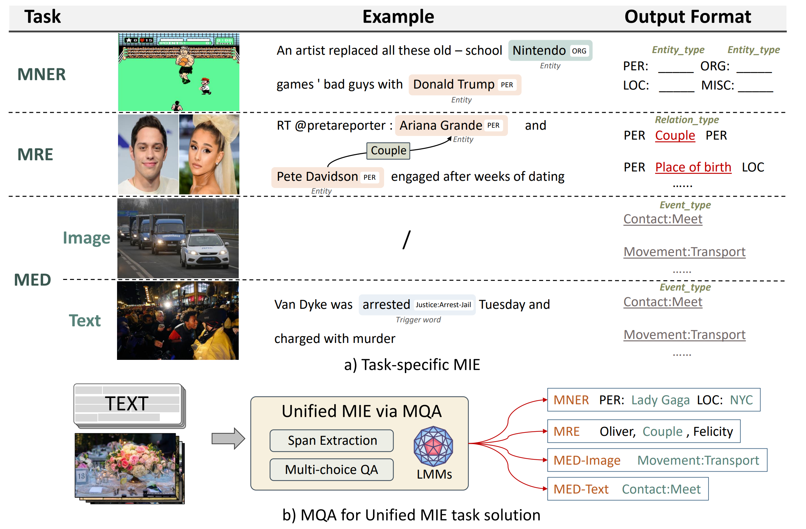
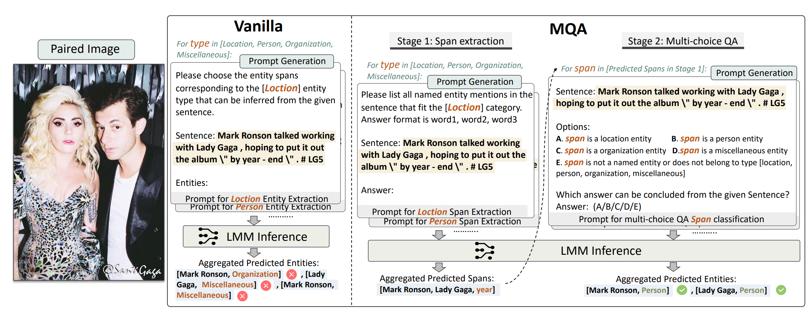

# <centering> MQA

This is the official repo for [Multimodal Question Answering for Unified Information Extraction](https://arxiv.org/abs/2310.03017)

# Abstract

Multimodal information extraction (MIE) aims to extract structured information from unstructured multimedia content. Due to the diversity of tasks and settings, most current MIE models are task-specific and data-intensive, which limits their generalization to real-world scenarios with diverse task requirements and limited labeled data. To address these issues, we propose a novel multimodal question answering (MQA) framework to unify three MIE tasks by reformulating them into a unified span extraction and multi-choice QA pipeline. Extensive experiments on six datasets show that: 1) Our MQA framework consistently and significantly improves the performances of various off-the-shelf large multimodal models (LMM) on MIE tasks, compared to vanilla prompting. 2) In the zero-shot setting, MQA outperforms previous state-of-the-art baselines by a large margin. In addition, the effectiveness of our framework can successfully transfer to the few-shot setting, enhancing LMMs on a scale of 10B parameters to be competitive or outperform much larger language models such as ChatGPT and GPT-4. Our MQA framework can serve as a general principle of utilizing LMMs to better solve MIE and potentially other downstream multimodal tasks.




# Method



With the vanilla prompting strategy, LMMs directly identify entities. This complicated and error-prone process may lead to inferior results (e.g., one same span can be classified as two different entity types). In contrast, our MQA framework decomposes a MIE task into two cascaded phases: **span extraction and multichoice QA**. Spans are extracted as candidates for later multi-choice QA. Each candidate span can be classified into pre-defined categories and one additional none-of-the-above option (E) to discard false positives from the span extraction stage.


# Usage


## Installation

```
conda create -n mqa python=3.8
conda activate mqa
pip install salesforce-lavis
```


## Data Preparation

**Twitter2015 & Twitter2017**

The text data follows the conll format. You can download the Twitter2015 data via this [link](https://drive.google.com/file/d/1qAWrV9IaiBadICFb7mAreXy3llao_teZ/view?usp=sharing) and download the Twitter2017 data via this [link](https://drive.google.com/file/d/1ogfbn-XEYtk9GpUECq1-IwzINnhKGJqy/view?usp=sharing). Please place them in `data/`.

**MNRE-V1 & MNRE-V2**

For MRE-V1, please download the data from https://github.com/thecharm/MNRE/tree/main/Version-1

And for MRE-V2, please refer to the https://github.com/thecharm/MNRE

**MEE**

The images and text articles are in [m2e2_rawdata](https://drive.google.com/file/d/1xtFMjt_eYgeBts5rBomOWbPo7wV_mnhy/view?usp=sharing), and annotations are in [m2e2_annotation](http://blender.cs.illinois.edu/software/m2e2/m2e2_v0.1/m2e2_annotations.zip).


The final data structural should be ordered as below:

```
MQA
 |-- data
 |    |-- mner
 |    |    |-- twitter2015  # text data
 |    |    |    |-- train.txt
 |    |    |    |-- valid.txt
 |    |    |    |-- test.txt
 |    |    |-- twitter2015_images       # raw image data
 |    |    |-- twitter2017
 |    |    |-- twitter2017_images
 |    |-- mre
 |    |    |-- mre_v1         
 |    |    |-- mre_v2   
 |    |-- mee
 |    |    |-- annotations       
 |    |    |-- raw_data     
```


### Run experiments

> Twitter

Twitter2017, take BLIP2-Flan-T5 XL as an example

```
bash scripts/blip2_flant5xl/ner_span_17.sh
bash scripts/blip2_flant5xl/ner_et_17.sh
```

Twitter2015, take BLIP2-Flan-T5 XL as an example

```
bash scripts/blip2_flant5xl/ner_span_15.sh
bash scripts/blip2_flant5xl/ner_et_15.sh
```


> #### MRE

MNRE-V1, take BLIP2-Flan-T5 XL as an example

```
bash scripts/blip2_flant5xl/re.sh
```


> #### MIED

```
bash scripts/blip2_flant5xl/iee.sh
```


> #### MTED

```
bash scripts/blip2_flant5xl/ee_span.sh
bash scripts/blip2_flant5xl/ee_et.sh
```

